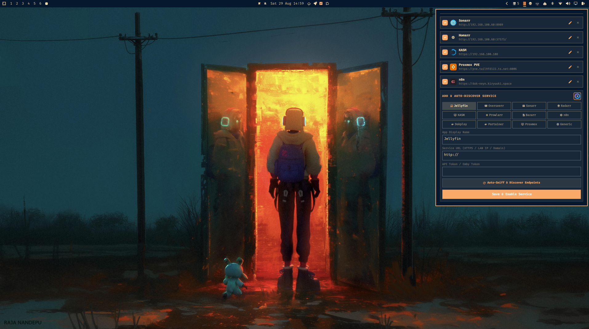

# OmaLab: Homelab Monitor and Launcher Sidepanel

A native, high-performance Homelab Monitoring and Interactive Launcher plugin for the Omarchy Desktop Shell.


---

## Features

- **Native Omarchy Bar Widget and Right-Aligned Flyout**: Smooth popout panel designed to match the native aesthetic, borders, typography, and corner radius tokens of Omarchy.
- **Deep Telemetry and Live Widgets**:
  - **Proxmox VE**: Live cluster CPU, RAM, and storage utilization gauges, with real-time running/stopped counts and status lists for QEMU Virtual Machines and LXC Containers.
  - **n8n**: Comprehensive workflow monitor (retrieving up to 250+ workflows), automatically sorted with Active workflows (ON) at the top and interactive 1-click on/off toggles.
  - **Jellyfin / Emby**: Real-time active streams, user sessions, media playback progress (%), transcoding badges, and pause states.
  - **Overseerr / Jellyseerr**: Pending media request queue with 1-click Approve and Decline actions.
  - **Sonarr / Radarr / Prowlarr / Bazarr**: Live download queue tracking with progress bars, download speed, and ETA countdowns.
  - **KASM Workspaces**: Container streaming session monitoring with dual-auth key and secret support.
  - **Dokploy and Portainer**: Container stack health and 1-click restart actions.
- **Graceful Healthcheck Fallback**: If an app's deep API encounters connection issues or authentication limits, the engine cascades to lightweight healthcheck endpoints (`/api/__healthcheck`, `/healthz`, root ping), marking the service as online with an amber API Warning badge so your launcher bookmarks always work.
- **In-Panel Service Manager and Endpoint Sniffer**:
  - **Auto-Sniff and Discover**: Probes remote APIs, validates credentials, and auto-detects selectable widget components.
  - **Edit and Delete**: Edit existing services in-place or toggle them on/off with checkboxes.
  - **Context-Aware Auth Fields**: Dynamically adjusts input fields for single API keys or dual credentials (Proxmox Token ID + Secret UUID, KASM Key + Secret).
- **DashboardIcons Integration**:
  - Automatically fetches and caches official vector SVG logos from the dashboard-icons repository for over 500+ self-hosted apps.
  - Offline-first cache in `~/.local/state/omarchy/homelab-icons/` for zero startup latency.
- **Persistent Expansion State**: Open cards stay expanded across background telemetry poll cycles.

---

## Previews



---

## App Integration Guides

### Proxmox VE
- **Header**: `Authorization: PVEAPIToken=USER@REALM!TOKENID=SECRET`
- **Permissions**:
  1. In Proxmox Web UI, go to **Datacenter** -> **Permissions** -> **Add** -> **API Token Permission**.
  2. Path: `/`
  3. API Token: `USER@REALM!TOKENID`
  4. Role: `PVEAuditor` (or `PVESysAdmin` / `Administrator`)
  5. Propagate: **Checked**

### KASM Workspaces
- **Credentials**: Enter both **API Key** and **API Key Secret** created in the KASM Admin Panel.
- **Fallback**: Automatically falls back to `/api/__healthcheck` if API access is restricted.

### n8n
- **Credentials**: Enter your API key created in n8n **Settings** -> **n8n API**.
- **Features**: Automatically sorts active workflows first with live status switches.

---

## Installation

Install using the Omarchy Plugin Manager:
```bash
omaplug install kiryuuki.oma-lab
```

### Register in `shell.json`
Add `{"id": "kiryuuki.oma-lab"}` to your `bar.layout.right` in `~/.config/omarchy/shell.json`:

```json
{
  "bar": {
    "layout": {
      "right": [
        { "id": "kiryuuki.oma-lab" }
      ]
    }
  }
}
```

Then restart the shell:
```bash
omarchy restart shell
```

---

## Keyboard Shortcuts

| Key | Action |
|---|---|
| `1` | Show All services |
| `2` | Filter by Media services |
| `3` | Filter by Downloads services |
| `4` | Filter by Infrastructure services |
| `5` | Filter by Automation services |
| `Up` / `Down` or `k` / `j` | Navigate services list |
| `Enter` / `Space` | Open selected service URL in browser |
| `e` / `Delete` | Toggle card expansion (show/hide live widgets) |
| `s` / `S` | Toggle In-Panel Settings |
| `r` / `R` | Trigger instant telemetry refresh |
| `Esc` | Close flyout |

---

## License

Source-Available Non-Commercial License (PolyForm Noncommercial 1.0.0). Free for personal, educational, and homelab use. Commercial sale, distribution for fee, or commercial re-licensing is prohibited without author permission.
